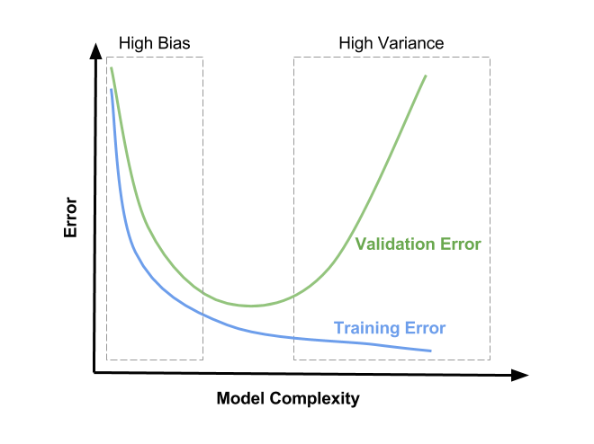

# Mistake Bounded Learning

Mistake Bounded Learning (MBL) is a fascinating and significant concept within the field of machine learning, especially in the realm of online learning and classification. 

> ℹ️ Online learning, in the context of machine learning, refers to a method where the model learns incrementally, updating its knowledge as new data points become available. Unlike traditional batch learning, where the model is trained on the entire dataset at once, online learning allows the model to adapt continuously as it receives new information.

Mistake Bounded Learning provides insight into how we can build more reliable, efficient, and robust machine learning models that can function effectively in diverse and dynamic environments.

## Definition and Core Concepts
Mistake Bounded Learning refers to a model where a learning algorithm has a predefined upper bound on the number of mistakes it can make during the learning process. A mistake occurs when the algorithm's prediction is incorrect. The core idea here is to provide guarantees about an algorithm's performance, ensuring that it will converge to a correct solution after a finite number of mistakes.

## Importance in Machine Learning
The importance of MBL cannot be understated, particularly in the context of online learning. Understanding and limiting the number of mistakes can lead to more efficient algorithms that learn more quickly from fewer examples. By bounding mistakes, one can also provide robustness in the face of noise and uncertainty. This is pivotal in building models that are resilient and capable of adapting to new information without significant degradation in performance.

While the concept of minimizing errors is relevant to a wider set of problem spaces and machine learning tasks, MBL is generally applied to on online learning and classification problems.

From a theoretical perspective, MBL offers a structured approach to understanding learning algorithms. It forms a bridge between learning theory and practical algorithm development, allowing researchers to make rigorous statements about how algorithms will perform.

On the practical side, bounding mistakes is vital in applications where errors are costly or need to be minimized. It adds a layer of safety and predictability to the algorithms, ensuring that they meet specific performance criteria.

## Applications in Machine Learning
Mistake Bounded Learning is not just a theoretical concept; it has been applied in various real-world scenarios:

- **Autonomous Systems**: In self-driving cars or drones, minimizing mistakes is critical for safety.
- **Medical Diagnostics**: In medical fields, an incorrect diagnosis can have severe consequences, making MBL valuable for creating reliable diagnostic tools.
- **Financial Modeling**: In finance, predictive models with bounded mistakes can lead to more stable and risk-averse investment strategies.

# MBL in the ML Development Process

In this section we'll discuss how MBL fits in to the overall [ML Model Development Process](./model-development-process.md). The following shows the outline of the 4 stages of ML Development Process, with the activities related to MBL highlighted.

**Stage 1: Problem Framing and Data Preparation**
- **Define the Problem**
  - *MBL Activity: Defining Mistake Bounds:* Set clear boundaries for errors, including acceptable thresholds for false positives, false negatives, etc.
  - *MBL Activity: Defining Metrics for Quantifying Mistakes:* Select effective metrics like precision, recall, F1 score, etc., to quantify errors aligned with predefined mistake budgets.
- Understand the Business or Scientific Objectives
- Gather and Prepare Data
- Exploratory Data Analysis (EDA)
- Feature Selection/Engineering
- Data Splitting

**Stage 2: Model Development and Evaluation**
- **Model Selection**
  - *MBL Activity: Selecting Appropriate Learning Algorithms and Mistake Bounding Techniques:* Opt for algorithms that can be bounded in terms of their mistakes, and apply techniques to bound mistakes within specified limits.
  - *MBL Activity: Model Selection:* Compare and evaluate models based on their alignment with defined mistake bounds.
- **Model Training**
  - *MBL Activity: Iterative Refinement:* Refine the model to reduce errors within predefined thresholds.
- **Model Validation and Tuning**
  - *MBL Activity: Fine-Tuning and Validation:* Fine-tune the model and validate its performance to achieve a balance between reducing errors and adhering to predefined thresholds.
- **Model Evaluation**
  - *MBL Activity: Error Bounding Validation:* Validate that model errors are within the specified bounds.

**Stage 3: Interpretation, Deployment, and Compliance**
- Model Interpretation
- Model Deployment
- Documentation
- Communication and Reporting
- Compliance and Ethics Review

**Stage 4: Ongoing Monitoring and Maintenance**
- **Monitoring and Maintenance**
  - *MBL Activity: Real-time Monitoring and Adjustments:* Continuously monitor real-world performance and make adjustments to ensure that the model stays within specified mistake bounds.
- Performance Monitoring
- Data Monitoring
- Model Retraining and Updating
- Feedback Loop Integration
- Health Monitoring
- Error and Exception Handling
- Security and Compliance Monitoring
- User Experience and Impact Analysis
- Documentation and Knowledge Preservation

## Defining Mistake Bounds

In the journey of Mistake-Bounded Learning (MBL), the first step involves setting clear boundaries on the number or type of errors your model is allowed to commit within a specific context. This involves defining "mistake budgets" that establish the acceptable thresholds for false positives, false negatives, or other pertinent metrics. By quantifying these limits, you create a framework that guides your model's behavior while aiming to strike the right balance between accuracy and acceptable mistakes.

## Defining Metrics for Quantifying Mistakes

While defining mistake bounds is a cornerstone of MBL, it's equally crucial to select metrics that effectively quantify the type and extent of errors your model might make. Metrics like precision, recall, F1 score, or other domain-specific measures become your measurement tools. These metrics align with your predefined mistake budget and goals, enabling you to assess the model's performance accurately and make informed decisions during the evaluation process.

## Selecting Appropriate Learning Algorithms and Mistake Bounding Techniques

Choosing the right learning algorithms is pivotal in embracing the principles of MBL. Opt for algorithms that can be effectively bounded in terms of their mistakes. Certain algorithms inherently align well with the MBL philosophy, granting you the ability to control and quantify errors. By integrating such algorithms into your workflow, you ensure that the mistakes made by your model are both understandable and manageable.

## Model Selection

In this stage, the models are compared and evaluated based on their ability to align with the defined mistake bounds. By assessing each model's performance in the context of acceptable errors and predefined thresholds, you can select a model that best embodies the delicate balance between error minimization and adherence to the mistake budgets. This process ensures that the chosen model will meet the specific needs and objectives of the Mistake Bounded Learning approach.

## Iterative Refinement
Mistake Bounded Learning often involves an iterative process where the model is continually refined to reduce errors while keeping them within the predefined thresholds. This activity focuses on adjusting parameters, modifying features, or employing other techniques that align with the established mistake bounds. By maintaining a consistent focus on error reduction and adherence to the set limits, the iterative refinement ensures that the model's performance aligns with the objectives of the MBL approach.

## Fine-Tuning and Validation
Fine-tuning the model and validating its performance is a specific focus of Mistake Bounded Learning. This activity involves adjusting hyperparameters, optimizing decision boundaries, and employing other techniques to fine-tune the model. The aim is to strike a balance between reducing errors and adhering to the predefined thresholds set in the mistake bounds. By methodically working towards this equilibrium, you ensure that the model performs optimally within the defined constraints, aligning with the principles of MBL.

## Error Bounding Validation
The objective of this validation step is to ensure that the model performs not just optimally but also responsibly, adhering to the predetermined thresholds for various errors like false positives, false negatives, and other mistake types. These boundaries can be associated with the model's functionality, safety, fairness, or other essential criteria.

## Real-time Monitoring and Adjustments

The MBL journey extends beyond initial model development. Continuously monitoring your model's real-world performance is vital. You'll make real-time adjustments to hyperparameters, decision thresholds, and even consider retraining the model when needed. This ongoing process ensures that the model maintains its performance while staying within the specified mistake bounds.

# Defining and Measuring Mistakes
In machine learning, mistakes made by models and algorithms are not mere inconveniences but crucial aspects that can directly affect the performance and reliability of a system. Understanding and quantifying these mistakes is vital for both model development and application. 

Defining and measuring mistakes in machine learning involves a multifaceted approach that incorporates statistical metrics, evaluation techniques, and ethical considerations. These components collectively enable researchers and practitioners to develop robust, reliable, and responsible models and algorithms.

## Mistake Bounds
Mistake Bounds play a crucial role in defining the acceptable limits of errors that a model can make within a specific context. They provide a controlled framework for quantifying and managing mistakes, ensuring that a model's behavior aligns with desired accuracy while accounting for a realistic margin of error.

By setting predefined thresholds on the number or types of mistakes, Mistake Bounds establish the range within which a model's performance is expected to operate. This concept is particularly important in scenarios where specific types of errors have varying implications, such as medical diagnoses or critical decision-making.

Mistake Bounds guide the evaluation, selection, and tuning of machine learning models by creating a framework that strikes a balance between minimizing errors and achieving reliable generalization. They serve as a guiding principle for effectively navigating trade-offs and making informed decisions during the model development process.

For example, consider a medical diagnostic model where the agreed-upon mistake bound is a maximum of 10% false negatives. This means the model should not miss more than 10% of actual positive cases (patients with the condition).

## Error Rates
- **Training Error:** The error measured on the same dataset that was used to train the model. It provides insights into how well the model is fitting the data it was trained on.
- **Test Error:** The error measured on a separate, unseen dataset. It gives a more unbiased estimate of how well the model generalizes to new data.
- **Generalization Error:** The difference between training error and test error, reflecting how well the model generalizes from the training data to unseen data.

## False Positives and False Negatives
- **False Positives (Type I Error):** Occurs when the model incorrectly predicts a positive outcome (e.g., classifying a healthy patient as sick).
- **False Negatives (Type II Error):** Occurs when the model incorrectly predicts a negative outcome (e.g., classifying a sick patient as healthy).
- **Precision and Recall:** These metrics help balance the trade-off between false positives and false negatives in classification tasks.
- **F1 Score:** A single metric that balances the trade-off between precision and recall.

A confusion matrix provides a detailed breakdown of the true positive, true negative, false positive, and false negative predictions made by a classification model, helping to visualize and quantify mistakes.

### Binary Classification Example
Let's consideer how false positives and false negatives can come into play in a binary classification problem. Suppose you have built a model to recognize a digit as either a '5' or a '0' from a handwriting sample.

**False Positive (Type I Error)**  
A false positive occurs when the model incorrectly classifies a digit that is not '5' as '5'. For instance, if the model misclassifies a '0' as a '5', this is a false positive.

**False Negative (Type II Error)**  
A false negative occurs when the model incorrectly classifies a digit that is '5' as something other than '5'. For instance, if the model misclassifies a '5' as a '0', this is a false negative.
 
**Precision**  
Precision is the ratio of true positive predictions to the sum of true positive and false positive predictions. In the context of recognizing the digit '5', precision would be the number of correctly identified '5's divided by the total number of digits predicted as '5', including both correctly and incorrectly classified '5's.

  $$
  \text{Precision} = \frac{\text{True Positives}}{\text{True Positives} + \text{False Positives}}
  $$

**Recall**  
Recall is the ratio of true positive predictions to the sum of true positive and false negative predictions. In the context of recognizing the digit '5', recall would be the number of correctly identified '5's divided by the total number of actual '5's in the data, including both correctly classified '5's and '5's that were misclassified as something else.

  $$
  \text{Recall} = \frac{\text{True Positives}}{\text{True Positives} + \text{False Negatives}}
  $$

In many classification tasks, there is a trade-off between precision and recall. If you optimize the model to increase precision (by being more conservative in predicting '5'), you may reduce the number of false positives but at the risk of increasing false negatives, thereby reducing recall. Conversely, if you optimize for recall (by being more liberal in predicting '5'), you may reduce false negatives but increase false positives, thereby reducing precision.

In the context of a binary digit classifier, depending on the specific requirements or constraints of your application, you might want to optimize for either higher precision (if false positives are more costly) or higher recall (if false negatives are more costly). 

**F1 Score**  
The F1 score is a single metric that balances the trade-off between precision and recall. It is calculated as the harmonic mean of precision and recall:

$$F1 = 2 \times \frac{precision \times recall}{precision + recall}$$

where:

* **precision** is the ratio of true positive predictions to the sum of true positive and false positive predictions.
* **recall** is the ratio of true positive predictions to the sum of true positive and false negative predictions.

In general, a higher F1 score indicates a better model. However, it is important to consider the specific requirements or constraints of your application when choosing a model.

**Confusion Matrix**  
Here is an example of a confusion matrix for a binary classifier:

|               Predicted | True       |    5    |    0    |
| :--------------------: | :---------: | :------: | :------: |
|                    5 |    5     | `100`    | `0`     |
|                    0 |    0     | `0`     | `100`    |

The diagonal entries of the confusion matrix represent the true positives and false negatives, while the off-diagonal entries represent the false positives and true negatives.

In this example, the model correctly classified 100 digits as '5' and 0 digits as '0'. However, it also misclassified 0 digits as '5' and 100 digits as '0'.

The precision of the model is 100%, since all of the digits that were predicted as '5' were actually '5'. The recall of the model is also 100%, since all of the actual '5's were correctly predicted.

The F1 score is 1.0, which is the maximum possible value. This means that the model is perfectly accurate.

This is an ideal case, where the model is perfectly accurate. However, in most cases, there will be some false positives and false negatives. The goal is to find a balance between precision and recall that is appropriate for the specific application.

In the context of a binary digit classifier, if false positives are more costly than false negatives, then you might want to optimize the model for higher precision. This would mean being more conservative in predicting '5', which would reduce the number of false positives but at the risk of increasing false negatives.

Conversely, if false negatives are more costly than false positives, then you might want to optimize the model for higher recall. This would mean being more liberal in predicting '5', which would reduce false negatives but increase false positives.

### Multi Classification Example

In a multi-class classification problem like MNIST digit classification, where there are more than two classes (0 to 9), false positives and false negatives can still be defined, but the interpretation is a bit more complex. Precision, recall, and related metrics can be extended to the multi-class setting using different averaging methods.

Here's how you might interpret false positives and false negatives, and compute precision and recall, for multi-class classification:

**False Positives (for a particular class)**  
The number of times a specific class (say '5') was predicted, but the true class was something else.

**False Negatives (for a particular class)**  
The number of times a specific class (say '5') was the true class, but the model predicted something else.

**Precision and Recall**  
You can calculate precision and recall for each class individually and then average them using micro-averaging or macro-averaging.

**Micro-Averaging**  
In micro-averaging, you sum up the individual true positives, false positives, and false negatives for each class, and then calculate precision and recall from these sums. This approach gives equal weight to each prediction and is sensitive to class imbalance.

$$
\text{Micro Precision} = \frac{\sum \text{True Positives}}{\sum \text{True Positives} + \sum \text{False Positives}}
$$

$$
\text{Micro Recall} = \frac{\sum \text{True Positives}}{\sum \text{True Positives} + \sum \text{False Negatives}}
$$

$$
\text{Micro F1 Score} = 2 \times \frac{\text{Micro Precision} \times \text{Micro Recall}}{\text{Micro Precision} + \text{Micro Recall}}
$$

**Macro-Averaging**  
In macro-averaging, you calculate precision and recall for each class separately and then take the unweighted mean of these values. This approach gives equal weight to each class and is not sensitive to class imbalance.

$$
\text{Macro Precision} = \frac{1}{N}\sum_{i=1}^{N}\frac{\text{True Positives}_i}{\text{True Positives}_i + \text{False Positives}_i}
$$

$$
\text{Macro Recall} = \frac{1}{N}\sum_{i=1}^{N}\frac{\text{True Positives}_i}{\text{True Positives}_i + \text{False Negatives}_i}
$$

$$
\text{Macro F1 Score}_i = 2 \times \frac{\text{Macro Precision}_i \times \text{Macro Recall}_i}{\text{Macro Precision}_i + \text{Macro Recall}_i}
$$

$$
\text{Macro F1 Score} = \frac{1}{N}\sum_{i=1}^{N}\text{Macro F1 Score}_i
$$

Where \( N \) is the number of classes, and the subscript $i$ refers to a specific class.

The choice between micro and macro averaging (and F1 score) depends on what you want the model to optimize for. Micro-averaging may be preferable if you care more about overall performance across all instances, while macro-averaging may be preferable if you care more about performance on individual classes.

**Confusion Matrix**  
You can also represent the errors in a confusion matrix, where each row represents the true class, and each column represents the predicted class. The diagonal entries represent true positives for each class, and the off-diagonal entries represent the mistakes.

| True\Predicted | 0  | 1  | 2  | 3  | 4  | 5  | 6  | 7  | 8  | 9  |
|----------------|----|----|----|----|----|----|----|----|----|----|
| 0              | 87 | 0  | 0  | 0  | 1  | 0  | 0  | 0  | 0  | 0  |
| 1              | 0  | 88 | 1  | 0  | 0  | 0  | 0  | 0  | 1  | 1  |
| 2              | 0  | 0  | 85 | 1  | 0  | 0  | 0  | 0  | 0  | 0  |
| 3              | 0  | 0  | 0  | 79 | 0  | 3  | 0  | 4  | 5  | 0  |
| 4              | 0  | 0  | 0  | 0  | 88 | 0  | 0  | 0  | 0  | 4  |
| 5              | 0  | 0  | 0  | 0  | 0  | 88 | 1  | 0  | 0  | 2  |
| 6              | 0  | 1  | 0  | 0  | 0  | 0  | 90 | 0  | 0  | 0  |
| 7              | 0  | 0  | 0  | 0  | 0  | 1  | 0  | 88 | 0  | 0  |
| 8              | 0  | 0  | 0  | 0  | 0  | 0  | 0  | 0  | 88 | 0  |
| 9              | 0  | 0  | 0  | 1  | 0  | 1  | 0  | 0  | 0  | 90 |

The confusion matrix is a square table with the true classes on the rows and the predicted classes on the columns. The diagonal entries of the confusion matrix represent the true positives for each class, and the off-diagonal entries represent the mistakes.

For example, in this confusion matrix, the digit "0" was correctly classified 87 times, the digit "1" was correctly classified 88 times, and so on. The digit "3" was misclassified as "5" 3 times, and the digit "5" was misclassified as "6" once.

The confusion matrix can be used to evaluate the performance of a multi-class classification model. Some of the metrics that can be calculated from the confusion matrix include:

## Bias and Variance
Models with high bias may oversimplify the problem, leading to consistent but significant mistakes (underfitting), while models with high variance may overfit to the noise in the training data, leading to mistakes in unseen data (overfitting).

In machine learning, bias and variance are often thought of as two ends of a spectrum, with a trade-off between the two. If a model has high bias, it tends to be overly simple, meaning it makes strong assumptions about the underlying pattern and may miss important nuances (underfitting). Conversely, a model with high variance is typically very flexible and can fit the training data closely, even to the point of fitting to the noise (overfitting).

### Bias
Bias in a machine learning model refers to the simplifying assumptions made to facilitate learning the target function. A model with high bias oversimplifies the problem, failing to capture the complexity in the data. This often results in underfitting, where the model doesn't pay enough attention to the nuances in the training data, leading to high errors on both training and test data. While this oversimplification might explain a general trend, it misses important details. 

High bias can also pose challenges in situations where adherence to specific mistake bounds is essential, as it may lead to more mistakes on the training data. 

### Variance
Variance in a machine learning model refers to how much the predictions change if the model is retrained with a different training dataset. A model with high variance is overly sensitive to small fluctuations or noise in the training data, leading to overfitting. This means the model pays excessive attention to the noise, treating it as if it were a real pattern, and thus fitting too closely to the training data. While this may result in a low error on the training data, it often leads to a high error on unseen data because the noise does not generalize.

In the context of Mistake-Bounded Learning (MBL), this overfitting and sensitivity to random fluctuations can complicate the process of defining a robust mistake bound. The model's learning from the "mistakes" or noise in the training data may hinder its ability to perform well on unseen data and stay within the specified mistake bounds.

### Tradeoffs

Visualizing this trade-off, you often see a U-shaped curve, where the total error (composed of bias, variance, and irreducible error) is minimized at the balance point between bias and variance. If you move too far towards high bias, the total error increases due to underfitting. If you move too far towards high variance, the total error increases due to overfitting. The goal in model training is to find the sweet spot that minimizes the total error.

The bottom of the U-shaped Validation Error line represents a balance between bias and variance. The error offset on the y-axis represents the irreducible error.

I'll talk more about error tradeoffs later in this document.

## Mistake Bounds vs. Model Performance Metrics: An example

**Mistake Bounds:**

Consider a medical diagnostic model where the agreed-upon mistake bound is a maximum of 10% false negatives. This means the model should not miss more than 10% of actual positive cases (patients with the condition).

**Model Performance Metrics:**

Let's assume we have a training dataset of 100 patients, with 20 having the condition (positive cases) and 80 not having the condition (negative cases). After running them through our classifier during training, we get the following:

- True Positives (TP): 15
- False Negatives (FN): 5
- True Negatives (TN): 70
- False Positives (FP): 10
- Total Predictions: 100

Calculating the metrics:

- False Positives Percentage = FP / (FP + TN) = 10 / 80 = 0.125 or 12.5%
- False Negatives Percentage = FN / (FN + TP) = 5 / 20 = 0.25 or 25%
- Precision = TP / (TP + FP) = 15 / (15 + 10) = 0.6 (60%)
- Recall = TP / (TP + FN) = 15 / (15 + 5) = 0.75 (75%)
- Error Rate = (FP + FN) / Total Predictions = (10 + 5) / 100 = 0.15 (15%)

**Interpreting the Example:**

In this instance, the set mistake bound for false negatives is not met. The model's false negative rate is 25%, meaning it misses 5 out of 20 positive cases, which exceeds the defined mistake bound of 10%. The recall is 75%, indicating that the model correctly identifies 75% of the actual positive cases. The precision indicates that 60% of the model's positive predictions are accurate, and the false positive rate is 12.5%.

While the model does not perform within the defined mistake bound for false negatives, other metrics like precision and the overall error rate provide insights into its effectiveness. These metrics can guide further refinement to minimize critical mistakes within the specific medical context.

# Model Evaluation and Selection

In the realm of machine learning, effective model evaluation and selection play a pivotal role in constructing models that generalize well to new data. This process involves assessing the performance of different algorithms and their corresponding hyperparameters to optimize predictive capabilities. Techniques like cross-validation are employed to minimize errors and make informed decisions regarding hyperparameter tuning and model selection.

Within the framework of Mistake-Bounded Learning (MBL), this evaluation and selection process often involves navigating trade-offs between various error types. The decision threshold, determining the point at which predictions are classified as positive or negative, becomes crucial. Adjusting this threshold can impact the balance between false positives and false negatives, requiring careful consideration based on the problem's context and priorities.

## Mistake Bounding Metrics

While traditional machine learning evaluation metrics like accuracy, precision, recall, and F1 score are relevant in MBL, additional attention is given to metrics that directly align with the mistake-bounded framework. 

Metrics such as the number of mistakes made, cumulative mistakes, and mistake rates (or error rates) take center stage. These metrics provide a clearer understanding of how well an algorithm adheres to the specified bounds.

## Cross-Validation

One fundamental technique in model evaluation is [cross-validation](./cross-validation.md). Cross-validation involves partitioning the available dataset into multiple subsets, training the model on a subset and validating it on another. This process is repeated iteratively, ensuring that each subset serves as both training and validation data. Cross-validation provides a more robust estimate of a model's performance by averting overfitting to a specific dataset partition. It aids in understanding how well a model generalizes to unseen data, thereby assisting in the selection of the most suitable model.

## Hyperparameter Tuning

Hyperparameters are essential settings that define a model's behavior, such as the learning rate or the depth of a decision tree. Model evaluation involves identifying the optimal combination of hyperparameters that results in the best performance on validation data. The aim is to strike a balance between bias and variance, ensuring the model captures underlying patterns without overfitting to noise.

Understanding the impact of different hyperparameters and their interplay with model performance helps to minimize mistakes. Techniques like grid search or random search explore various combinations of hyperparameters to find the configuration that maximizes predictive accuracy. By identifying and rectifying mistakes that arise from suboptimal hyperparameter choices, models can be fine-tuned to deliver superior results.

## Trade-offs in Model Complexity: Bias, Variance, and Regularization

Understanding the trade-offs and how they impact generalization in learning algorithms is vital to building effective models.

This section provides an overview of the trade-offs between bias and variance, overfitting and underfitting, and the techniques to achieve generalization, including regularization methods.

### Model Complexity
One big challenge with building a model is finding the right balance between bias and variance. Too much bias leads to underfitting, where the model is too simple to capture the patterns in the data. Too much variance leads to overfitting, where the model is overly complex and captures the noise in the data. The goal is to find a sweet spot that minimizes both errors, achieving a model that generalizes well from the training data to unseen data. This is often visualized as a U-shaped curve, where the total error is minimized at the optimal balance of bias and variance.

- **High Bias (Underfitting):** A model that is too simple may fail to capture the underlying patterns in the data, resulting in high bias. This leads to underfitting, where the model performs poorly on both training and unseen data.
- **High Variance (Overfitting):** A model that is too complex may fit the noise in the training data rather than the actual patterns, resulting in high variance. This leads to overfitting, where the model performs well on the training data but poorly on unseen data.
- **Regularization Techniques:** Regularization methods like L1 or L2 regularization are often used to prevent overfitting by adding penalties to the loss function, effectively controlling the complexity of the model.

### Generalization
Generalization is the ultimate goal in machine learning, where the model's predictions extend beyond the training data to new, unseen data. The ability to generalize is influenced by:
- **Training and Validation Split:** Ensuring a proper division of data into training and validation sets helps in evaluating how well the model is likely to perform on unseen data.
- **Cross-Validation:** This technique helps in assessing how the results of a statistical analysis will generalize to an independent dataset.
- **Evaluation Metrics:** Metrics like accuracy, precision, recall, and F1 score, as well as mistake rates and cumulative mistakes, can provide a more detailed view of generalization.

Balancing mistakes and complexity through regularization, proper model selection, and careful evaluation ensures that the model not only fits the training data but is also likely to make accurate predictions on new data.

### Comparing the Tradeoffs

The following table provides some insights into the tradeoffs between the bias and variance:

| Bias-Variance Trade-off | Fit              | Model Complexity  | Training Precision | Training Recall | Testing Precision | Testing Recall | Generalization Performance | Optimal Use Case                             | Regularization Techniques |
|------------------------|------------------|-------------------|--------------------|-----------------|-------------------|----------------|--------------------------|--------------------------------------------|---------------------------|
| High Bias              | Underfit         | Low               | Low               | Low             | Low               | Low            | Poor                     | Limited by Data Size or Interpretability   | L1/L2 Regularization     |
| High Variance          | Overfit          | High              | High              | Low             | Low               | Low            | Poor                     | Complex Models, Large Datasets            | Dropout, Regularization |
| Balanced Bias & Variance | Well-Fit       | Moderate          | Moderate          | Moderate        | Moderate          | Moderate       | Good                     | Practical Balance Between Bias and Variance | Varies                  |

Fit:

- **Underfit**: The model is too simplistic, failing to capture underlying patterns.
- **Overfit**: The model is overly complex, capturing noise and struggling to generalize.
- **Well-Fit**: The model achieves a balanced level of complexity, capturing relevant patterns without overfitting.

Model Complexity:

- **Low**: The model is too simple to capture complex relationships.
- **High**: The model is complex, fitting the training data closely.
- **Moderate**: The model strikes a balance between simplicity and complexity.

Training Precision:

- **Low**: The model's predictions have low accuracy among positive predictions.
- **High**: The model's predictions are highly accurate among positive predictions.
- **Moderate**: The model achieves moderate accuracy among positive predictions.

Training Recall:

- **Low**: The model misses a significant number of actual positive instances.
- **High**: The model identifies most actual positive instances.
- **Moderate**: The model achieves moderate recall of actual positive instances.

Testing Precision:

- **Low**: The model's predictions have low accuracy among positive predictions on new data.
- **High**: The model's predictions are highly accurate among positive predictions on new data.
- **Moderate**: The model achieves moderate accuracy among positive predictions on new data.

Testing Recall:

- **Low**: The model misses a significant number of actual positive instances on new data.
- **High**: The model identifies most actual positive instances on new data.
- **Moderate**: The model achieves moderate recall of actual positive instances on new data.

Generalization Performance:

- **Poor**: The model struggles to generalize to new, unseen data.
- **Good**: The model generalizes well to new data.
- **Varies**: Generalization performance varies across fit levels.

Optimal Use Case:

- **Limited by Data Size or Interpretability**: Underfit models might be suitable for smaller datasets or when interpretability is crucial.
- **Complex Models, Large Datasets**: Overfit models can be effective when dealing with large datasets and complex patterns.
- **Practical Balance Between Bias and Variance**: Well-fit models are practical for achieving a balance between bias and variance.

Regularization Techniques:

- **L1/L2 Regularization**: Used to mitigate high bias by adding penalty terms to the model's loss function.
- **Dropout, Regularization**: Used to mitigate high variance by randomly dropping units during training.
- **Varies**: Regularization techniques vary based on specific fit levels and problem contexts.

### An Example
Suppose you decide to build a very simple model, such as a linear classifier, to recognize the handwritten digits in the MNIST dataset. Since the dataset contains complex patterns representing handwritten numbers from 0 to 9, a linear classifier might be too simple to capture these patterns.

**Result of High Bias**
- **Training Error:** The model may perform poorly even on the training data because it cannot capture the complexity of the handwritten digits.
  - Training accuracy: 89%
  - Training error rate: 11%
- **Test Error:** The model also performs poorly on unseen data (test data), as it fails to generalize the complex patterns in the digits.
  - Test accuracy: 87%
  - Test error rate: 13%
- **Interpretation:** The high bias causes the model to oversimplify the problem, missing the intricate details that differentiate one digit from another.

Now, consider a very complex model, like a deep neural network with many layers and neurons, and without proper regularization or an excessive number of training epochs. This model has the capacity to learn even the tiniest details and noise in the training data.

**Result of High Variance**
- **Training Error:** The model performs exceptionally well on the training data, fitting even the noise in the data.
  - Training accuracy: 98%
  - Training error rate: 2%
- **Test Error:** On unseen data (test data), the model performs poorly. The details and noise it learned from the training data do not generalize well to new data, leading to mistakes in classification.
  - Test accuracy: 88%
  - Test error rate: 12%
- **Interpretation:** The high variance causes the model to learn too much from the training data, including irrelevant noise and details, resulting in poor generalization to new data.

In the context of the MNIST digit classification:
- A high bias model (e.g., a simple linear classifier) may fail to capture the complex patterns in the digits, leading to underfitting.
- A high variance model (e.g., an overly complex deep neural network) may learn the noise and random details in the training data, leading to overfitting.
- Achieving the right balance between bias and variance is key to building a model that performs well both on the training data and unseen data. Techniques like cross-validation, regularization, early stopping, or using an appropriate model complexity can help in finding this balance.

## Trade-offs in Decision Making: Balancing Errors and Thresholds

Model evaluation and selection in MBL often involves navigating trade-offs between different types of errors. The decision threshold, which determines the point at which predictions are classified as positive or negative, becomes crucial. Adjusting this threshold can affect the balance between false positives and false negatives, and it requires careful consideration based on the problem's context and priorities.

> ℹ️ While this section and the previous section discuss trade-offs, they are related to different stages and aspects of the modeling process. The former deals more with the complexity of the model and how to ensure it generalizes well, while this section is concerned with the decision-making process related to classification and evaluation of the model.

### Cost-Sensitivity Analysis

In the context of decision-making within machine learning models, cost-sensitivity analysis is vital in understanding the impact of classification errors. The cost associated with false positives and false negatives may differ significantly based on the specific problem being addressed.

- **Understanding the Costs:** For some applications, a false positive might be more detrimental than a false negative, and vice versa. In medical diagnostics, for example, a false negative (failing to identify a disease) might have far more serious consequences than a false positive (incorrectly identifying the presence of a disease).
- **Incorporating Costs into the Model:** By quantifying these costs, you can integrate them into the model evaluation process. This might involve using a cost matrix that assigns specific penalties to different types of errors.
- **Threshold Adjustment:** Understanding the cost structure can guide the optimal threshold setting. If false negatives are more costly, the threshold might be set lower to minimize them, even if this means accepting more false positives.
- **Application in Various Fields:** Cost-sensitivity analysis is not limited to healthcare but can be applied across various industries such as finance, where the cost of fraudulent transactions must be weighed against the inconvenience of false alarms.

### Methods for Adjusting the Threshold

Adjusting the decision threshold is a critical step in optimizing the performance of a classification model. Several methods can guide this process, and these can be used in conjunction with or as alternatives to ROC curve analysis.

- **Precision-Recall Curve Analysis:** This method focuses on the trade-off between precision (the ratio of true positives to true positives plus false positives) and recall (the ratio of true positives to true positives plus false negatives). Analyzing this curve can provide insights into how the threshold affects these metrics, enabling the selection of a threshold that meets specific objectives.
- **Cost-Benefit Analysis:** By explicitly defining the costs and benefits associated with different types of errors, this method can guide the threshold setting based on economic considerations. This aligns closely with cost-sensitivity analysis, applying monetary or other quantifiable metrics to the decision-making process.
- **Youden’s Index:** This is a statistical measure that captures the performance of a diagnostic test. It's defined as Sensitivity + Specificity - 1 and can be used to find the threshold that maximizes the sum of sensitivity and specificity.
- **Grid Search or Random Search:** These techniques can be used to systematically explore a range of threshold values, evaluating performance based on a chosen metric like F1-score or the overall cost of errors.
- **Cross-Validation with Different Thresholds:** Performing cross-validation while adjusting the threshold in each fold allows for a robust assessment of how the threshold setting impacts the model’s performance across different segments of the data.

Together, these methods provide a rich toolkit for understanding and manipulating the decision threshold, allowing for fine-tuned control over the classification model’s performance in alignment with specific goals and constraints.

### An Example

In classification problems, the decision threshold is the point at which a prediction changes from one class to another. Adjusting this threshold can have significant impacts on the performance of a model.

In the context of the MNIST digit classification example we provided in the discussion of Model Complexity trade-offs above, let's consider how altering the decision threshold might affect our results:

- **Lowering the Threshold:** Reducing the decision threshold means that the model will classify a digit into a positive class more easily.
  - **Pros:** This might increase the true positive rate, recognizing more actual digits correctly.
  - **Cons:** At the same time, it might also increase the false positive rate, misclassifying other numbers.
  - **Example:** If the decision threshold is lowered from 0.5 to 0.3, more digits may be classified as a particular number, but at the risk of misclassifying other numbers.

- **Raising the Threshold:** Increasing the decision threshold means that the model will be more conservative in classifying a digit into a positive class.
  - **Pros:** This might decrease the false positive rate, making the model more specific to the actual digits.
  - **Cons:** However, it might also increase the false negative rate, failing to recognize some digits that should be classified positively.
  - **Example:** If the decision threshold is raised from 0.5 to 0.7, the model may be less prone to false positives but might miss some true positives.

- **Finding the Optimal Threshold:** Achieving the right balance between false positives and false negatives is a critical trade-off. Techniques like ROC curve analysis can guide the selection of an optimal threshold, balancing sensitivity and specificity.
  - **Example:** By analyzing the ROC curve, we might find a threshold of 0.55 that minimizes both false positives and false negatives for our specific problem.

The trade-offs in decision threshold highlight the importance of understanding the specific context and goals of the classification task. In the MNIST digit classification problem, optimizing the decision threshold could lead to a more accurate and robust model, tailored to the specific needs and tolerances of the application.

## Summary
In conclusion, model evaluation and selection involve a careful interplay of techniques like cross-validation, hyperparameter tuning, and a deep understanding of the mistakes a model can make. This iterative process aims to construct models that generalize well, minimize errors, and align with specific goals, ultimately contributing to the success of machine learning applications.

# PAC Learning and Sample Complexity

The [Probably Approximately Correct (PAC)](./pac-learning.md) learning framework is a fundamental concept in computational learning theory that describes what it means for a learning algorithm to perform well. It forms a bridge to Mistake-Bounded Learning (MBL) by providing a mathematical foundation for defining and bounding mistakes within learning algorithms. Below are the core aspects of the PAC framework, including its relation to sample complexity and achievable mistake bounds.

## Relation to Mistake-Bounded Learning and Sample Complexity
PAC learning and MBL are closely related as they both focus on bounding mistakes within learning algorithms. While PAC provides guarantees on generalization error, MBL concerns the number of mistakes made during the learning process.

- **Sample Complexity:** In PAC learning, the sample complexity determines the number of examples required to ensure that a learner can find a hypothesis within the given error bounds with high probability. It helps to quantify the trade-off between accuracy, confidence, and the amount of data required.

- **Achievable Mistake Bounds:** MBL uses a mistake-bound model to define an upper limit on the number of mistakes that a learner can make during training. PAC learning complements this by providing a theoretical framework to understand and quantify these bounds.

## Example
A classifier could be considered PAC-learnable if there exists an algorithm that can, with probability $1 - \delta$, find a classifier that misclassifies no more than an $\epsilon$ fraction of the examples, and it can do so in polynomial time.

The PAC framework has been instrumental in shaping the theoretical understanding of learning algorithms, including mistake-bounded learning. It connects areas like statistical learning, information theory, and computational complexity to create a solid foundation for understanding the principles of machine learning.

# Regularization

Regularization is a critical technique in machine learning to prevent overfitting. Overfitting happens when a model learns the training data too well, including its noise, thus performing poorly on unseen data.

## Types of Regularization

### L1 Regularization (Lasso)
L1 regularization adds the sum of the absolute values of the coefficients as a penalty term to the loss function. It can lead to sparsity, making some coefficients exactly zero.
- **Formula:** $L1\, Loss = Loss + \lambda \cdot \Sigma |w_i|$

### L2 Regularization (Ridge)
L2 regularization adds the sum of the squared values of the coefficients as a penalty term. It generally keeps the coefficients small but doesn't force them to zero.
- **Formula:** $L2\, Loss = Loss + \lambda \cdot \Sigma w_i^2$

## Why Use Regularization?

1. **Prevents Overfitting:** By adding a penalty term, regularization ensures the model doesn't fit the training noise.
2. **Feature Selection:** L1 regularization can lead to zero coefficients, effectively performing feature selection.
3. **Model Complexity Control:** Controls the complexity of the model by constraining the parameter space.

## Incorporation into Algorithms

Regularization techniques are incorporated into many algorithms, such as:
- Linear Regression
- Logistic Regression
- Neural Networks
- Support Vector Machines

## Hyperparameter Tuning

The strength of regularization is controlled by a hyperparameter, often denoted as $\lambda$. Tuning this hyperparameter is essential for optimal performance.

## Conclusion

Regularization is a versatile and powerful technique in machine learning, used to balance bias-variance tradeoff and prevent overfitting. Its proper application enhances the model's generalization ability and often leads to better performance on unseen data.

# Mistake Bounded Algorithms
In the context of MBL, bounding mistakes is crucial in ensuring that a model stays within acceptable error limits. Various techniques and strategies are designed to provide these bounds, and they are often tailored to specific applications and domains. Here, we will delve into some prominent methods.

| Algorithm                                | Type of ML Model             | When/Why It Might Be Used                                                                         |
|------------------------------------------|-------------------------------|---------------------------------------------------------------------------------------------------|
| Support Vector Machines (SVM) with Margin   | Binary Classification        | To create a robust model with a buffer zone, minimizing classification errors                      |
| Boosting Algorithms with Weak Learners     | Ensemble Method              | To improve model performance by combining weak learners, controlling mistakes through weighting     |
| Perceptron Algorithm                        | Binary Classification        | Used for linearly separable data, updates weights additively                                       |
| Winnow Algorithm                            | Binary Classification        | Useful when many features are irrelevant, updates weights multiplicatively                          |
| Halving Algorithm                           | Binary Classification        | Used when hypotheses are finite, eliminates half of the hypotheses at each step                    |
| Multiplicative Weight Update Algorithm      | Binary Classification/Ensemble Method | Used in various contexts, including ensemble methods where weights are updated multiplicatively      |
| Consistency Algorithms (e.g., C4.5)         | Decision Trees/Ensemble Methods | Minimizing mistakes over the long term                                                              |

## Support Vector Machines (SVM) with Margin
SVM with Margin utilizes a hyperplane to classify data points while maintaining a buffer zone that minimizes classification errors. This margin ensures that the algorithm makes fewer mistakes, even in the presence of noise.

### Applications
- Binary Classification
- Text Categorization
- Image Recognition

### Benefits and Challenges
- Benefits: High accuracy, robustness to noise.
- Challenges: Sensitive to the choice of kernel, may require careful tuning of hyperparameters.

## Boosting Algorithms with Weak Learners
Boosting involves combining several weak learners to create a strong learner. By carefully weighting and adjusting the learners, mistakes are controlled and overall performance is improved.

### Applications
- Ensemble Learning
- Regression
- Classification

### Benefits and Challenges
- Benefits: Improves accuracy, reduces bias.
- Challenges: Prone to overfitting, computationally expensive.

## Perceptron Algorithm
A binary classification algorithm used for linearly separable data, the Perceptron Algorithm updates weights additively to minimize mistakes.

### Applications
- Binary Classification
- Linear Regression

### Benefits and Challenges
- Benefits: Simple and efficient.
- Challenges: Only applicable to linearly separable data.

## Winnow Algorithm
The Winnow Algorithm is useful when many features are irrelevant. It updates weights multiplicatively and is designed to minimize mistakes.

### Applications
- Binary Classification
- Feature Selection

### Benefits and Challenges
- Benefits: Deals well with irrelevant features, simple updates.
- Challenges: Requires careful tuning, only for linear problems.

## Halving Algorithm
The Halving Algorithm is used when hypotheses are finite. It eliminates half of the hypotheses at each step, thereby controlling mistakes.

### Applications
- Binary Classification
- Hypothesis Selection

### Benefits and Challenges
- Benefits: Fast convergence, simplicity.
- Challenges: Requires finite hypothesis space.

## Multiplicative Weight Update Algorithm
This algorithm updates weights multiplicatively and is used in various contexts, including ensemble methods. It's a versatile technique for controlling mistakes.

### Applications
- Binary Classification
- Ensemble Learning

### Benefits and Challenges
- Benefits: Flexibility, adaptability.
- Challenges: Sensitive to learning rate, may require careful tuning.

## Consistency Algorithms (e.g., C4.5)
Consistency Algorithms focus on long-term mistake minimization and are used to create models that are consistent with the training data.

### Applications
- Decision Trees
- Ensemble Methods

### Benefits and Challenges
- Benefits: Minimizes long-term mistakes.
- Challenges: May overfit to noise, computational complexity.

# VC Dimension and Model Complexity

VC (Vapnik-Chervonenkis) dimension is a measure of the capacity or complexity of a statistical classification algorithm. It gives an idea of the model's flexibility in fitting to the data. The relationship between VC dimension, hypothesis class complexity, and mistake bounds is an essential concept in learning theory, particularly in the context of mistake-bounded learning.

## Understanding VC Dimension

VC dimension provides a way to quantify the expressive power of a model. A higher VC dimension indicates a more flexible model, but it can also lead to overfitting. Conversely, a lower VC dimension may imply a more restricted model that could underfit the data.

### Definition

The VC dimension is the largest number of points that can be shattered (i.e., classified in all possible ways) by a given model. If a model can shatter any configuration of `d` points but not `d+1`, its VC dimension is `d`.

### Implications

A higher VC dimension allows a model to fit more complex patterns but also increases the risk of overfitting. This concept has practical implications in model selection, particularly in choosing the complexity and parameters of the model.

## Hypothesis Class Complexity

Hypothesis class complexity is closely related to the VC dimension. It refers to the set of possible functions or models that can be chosen by a learning algorithm.

### Relationship with VC Dimension

A more complex hypothesis class (i.e., one with more functions) generally has a higher VC dimension. This reflects greater flexibility in fitting to the data, which can be both an advantage and a disadvantage.

## How VC Dimension Affects Mistake Bounds

The VC dimension plays a crucial role in determining mistake bounds. In the context of mistake-bounded learning, understanding the VC dimension can guide model selection and the design of learning algorithms.

### Bounds on Generalization Error

The VC dimension provides a bound on the generalization error, helping to estimate how well the model will perform on unseen data. Models with a higher VC dimension may require more data to achieve a desired level of generalization.

### Sample Complexity

Sample complexity refers to the number of samples needed to guarantee a particular level of performance. A higher VC dimension typically means that more samples are required to achieve the same level of confidence in the learning results.

## Conclusion

Understanding VC dimension and its relationship with hypothesis class complexity and mistake bounds is vital for model selection and algorithm design. It provides a framework to balance the flexibility and complexity of models to achieve desired learning outcomes, without undue risk of overfitting or underfitting.

# Challenges and Open Questions
Exploration of current challenges, areas of ongoing research, and potential future directions within mistake bounded learning.

# Safety and Ethical Considerations
Possible exploration of the ethical implications of mistake bounds in contexts like autonomous driving or healthcare.

Mistakes in machine learning models can have real-world consequences, especially in sensitive areas like criminal justice or healthcare. Transparency, fairness, and accountability in quantifying and handling mistakes become paramount.

# Example: Building an MNIST Digit Classifier Using Mistake-Bounded Learning (MBL)

The following example illustrates the end-to-end application of MBL to build a digit classifier using the MNIST dataset. Given the importance of accurate digit recognition in fields like healthcare, where handwritten medical records must be correctly interpreted, the stakes are high. A mistake in recognizing a digit could lead to incorrect patient information, affecting care decisions and outcomes.

In this context, we are going to explore how MBL works in building a feed-forward neural network with a single hidden layer (ReLU) and one output layer (softmax). The goal is to showcase the entire process of model evaluation, selection, and tuning, guided by the principle of Mistake-Bounded Learning.

We will consider various aspects such as defining a mistake budget, cross-validation iterations, model performance monitoring, trade-offs, decision thresholds, hyperparameter tuning, and more. The process will also include evaluating other models with different architectures or expanded inputs to find the best fit within the mistake-bounded framework.

Let's dive into the process, focusing on the critical application of digit recognition in handwritten medical records, where each step must be carefully aligned to ensure that the chosen model remains within the predefined mistake budget.

## Initial Model & Metrics

Let's say that we start with the following architecture for our classifier:

- **Hidden Layer:** 1 hidden layer with ReLU activation
- **Output Layer:** Softmax activation
- **Training Data:** 60k labeled examples
- **Iterations:** 2000
- **Initial Accuracy:** ~90%

## Mistake Budget

In the context of Mistake-Bounded Learning (MBL), the mistake budget is a fundamental and critical concept that governs the entire process of model evaluation and selection. Defining this budget helps in creating a safety net around the model's performance, ensuring that it operates within acceptable error limits.

Since the task at hand involves digit recognition for handwritten medical records, even a small mistake in recognizing digits can lead to substantial errors in patient data. For example, misinterpreting a '5' as a '3' could lead to incorrect dosage information in a prescription, causing potentially life-threatening situations.

Given this high-stakes scenario, the mistake budget becomes a pivotal component. It's not just about achieving high overall accuracy; it's about controlling specific mistakes that could have grave consequences.

### Maximum False Negatives
In this specific case, the mistake budget will focus on false negatives, i.e., the instances where the model fails to recognize a correct digit. A false negative here means a missed opportunity to correctly interpret vital information, leading to potential errors in medical decisions.

- **Maximum False Negatives:** We will set a budget of 50 false negatives across the entire validation process. This number is determined based on a thorough analysis of the application context, acceptable risk levels, and the potential impact of each misclassification.

### Contextual Understanding
It's essential to understand that the mistake budget is not an arbitrary number. It should be established with a clear understanding of the domain, the users, and the potential real-world impact of each mistake. In the medical field, where precision is paramount, setting a stringent mistake budget ensures that the model's predictions align with the level of accuracy required to maintain patient safety and care quality.

### Alignment with Overall Goals
The mistake budget also aligns with the overall goals of the model, bridging the gap between statistical accuracy and real-world applicability. It helps in tailoring the model not just to perform well on general metrics but to excel in the specific areas that matter most for the application at hand.

In summary, defining the mistake budget for our digit classifier is not just a technical step; it's a strategic decision that intertwines the model's mathematical performance with the real-world requirements and constraints of the application domain. This step sets the stage for the subsequent processes of model evaluation, selection, and tuning, all guided by the principle of staying within this carefully defined budget of acceptable mistakes.

## Cross-Validation Iterations

Cross-validation is a crucial step in assessing a model's performance, especially when using Mistake-Bounded Learning. By simulating the model's real-world performance across different subsets of the data, cross-validation helps in understanding how the model might perform outside the training dataset.

### k-Fold Cross-Validation

In our case, we'll use k-Fold Cross-Validation, where the data is divided into 'k' subsets, or folds. The model is trained on 'k-1' folds and tested on the remaining fold. This process is repeated 'k' times, with each fold serving as the test set once.

- **Number of Folds (k):** 10
- **Training Folds:** 9
- **Testing Fold:** 1

### Iterative Performance Evaluation

With each iteration, the model's performance is assessed, particularly focusing on the false negatives, which are crucial in our mistake budget.

- **Target Metric:** False negatives
- **Maximum Allowed Per Fold:** 5
- **Cumulative False Negatives:** Monitored to ensure it stays within the budget of 50

### Model Response to Different Data Subsets

Each iteration in k-fold cross-validation is a new opportunity to understand how the model responds to different data subsets. It helps in revealing any potential biases or inconsistencies and ensures that the model is robust to various inputs and conditions.

### Adherence to Mistake Budget

During cross-validation, the cumulative count of false negatives across iterations must remain within the predefined mistake budget. If a specific iteration results in more false negatives than the budget allows, it would indicate a need for model re-evaluation or adjustment.

- **Monitoring Strategy:** Track false negatives after each iteration
- **Adjustment Mechanism:** If the cumulative count approaches the budget, reassess hyperparameters or model architecture

### Selection of Optimal Model

Cross-validation allows for the evaluation of different models, including those with more layers or different architectures. By comparing the performance across various models, always considering the mistake budget, the optimal model for the specific application can be selected.

### Summary

Cross-validation iterations are a cornerstone in the MBL framework. It allows for systematic evaluation, tuning, and selection of the model, guided by the real-world implications of specific mistakes. In the context of our digit recognition task, where every mistake could have significant consequences, the iterative process of k-fold cross-validation serves as an invaluable tool in achieving both accuracy and reliability within the bounds of acceptable mistakes.

## Model Performance Monitoring

While the cross-validation iterations provide valuable insights into the model's performance, continuous monitoring of the model after deployment is equally crucial. This phase ensures that the model remains within the mistake budget not just during validation but throughout its real-world application.

### Continuous Monitoring Methodologies
Continuous monitoring involves regularly checking the model's performance, especially in terms of false negatives. This can include tracking real-time metrics, setting up alerts, and implementing automated retraining strategies to ensure that the model stays within the defined mistake budget.

### Long-Term Stability
Over time, the data distribution may change, causing what is known as 'model drift.' Monitoring long-term stability involves setting up mechanisms to detect these shifts early and adjusting the model as needed to maintain adherence to the mistake budget.

### Real-World Application Monitoring
In the context of handwritten medical record interpretation, real-world monitoring could involve continuous feedback loops with medical professionals, regular audits of predictions, and in-depth analyses of any mistakes. This ongoing process ensures that the model's predictions remain reliable, accurate, and within the bounds of acceptable risk.

In summary, model performance monitoring extends the principles of Mistake-Bounded Learning beyond the training and validation phases. It ensures ongoing alignment with the mistake budget, providing a comprehensive, responsive approach to model management in a critical application domain.

## Hyperparameter Tuning

Hyperparameter tuning is a crucial step in developing a model that performs well on a specific task while adhering to constraints like a mistake budget. This is more complex than simply seeking the highest accuracy; it requires aligning the model's performance with constraints set by the mistake budget, particularly regarding false negatives.

### Methods of Tuning
- **Grid Search or Random Search:** Hyperparameter tuning can be carried out using grid search or random search. These methods search the hyperparameter space to find the optimal set that yields the desired performance while keeping false negatives within the mistake budget.
- **Metrics Consideration:** The tuning process might use metrics like the F1-score, sensitivity, and specificity. These metrics can help create a balanced model that minimizes critical mistakes (e.g., false negatives).
- **Iterative Refinement:** Hyperparameter tuning often involves several iterations. Each iteration refines the hyperparameters, evaluating them against both the general performance metrics and the mistake budget to find the optimal balance.

### Tuning Within Constraints
- **Adherence to Mistake Budget:** The cumulative false negatives across cross-validation iterations must remain within the predefined mistake budget. The tuning process must be carefully managed to maintain this balance.
- **Alignment with Performance Metrics:** Hyperparameter tuning must also consider the model's overall performance requirements, such as accuracy, recall, and precision. The goal is to find the best hyperparameters that satisfy all criteria.

In summary, hyperparameter tuning in the context of Mistake-Bounded Learning is a nuanced process that aligns the technical aspects of modeling with real-world requirements and constraints. By focusing not just on overall performance but on specific mistakes within the defined budget, hyperparameter tuning ensures that the chosen model serves the application's unique needs in a manner that respects the defined boundaries of acceptable errors.

## Trade-offs and Decision Thresholds

Modeling in real-world scenarios, especially in critical applications like medical digit recognition, requires a delicate balance between different types of errors. The trade-offs between false positives and false negatives and the decision thresholds that govern them play a critical role in shaping the model's behavior.

### Balance Between False Positives and Negatives
- **Tuning Thresholds:** The model's decision threshold can be tuned to strike the desired balance between false positives and false negatives. This tuning involves careful experimentation to find the optimal threshold that maximizes recall while adhering to the mistake budget.
- **Impact on Metrics:** Altering the decision threshold affects various performance metrics like precision, recall, F1-score, and more. Understanding this interplay is vital to achieving the desired performance.

### Adherence to Mistake Budget
- **Threshold Selection:** The selected threshold must ensure that false negatives remain within the predefined mistake budget. It's not just about optimizing statistical metrics but aligning them with real-world constraints.
- **Monitoring and Alignment:** Continuous monitoring and alignment with the mistake budget are essential as data distribution and characteristics may change over time.

### Experimentation with Different Thresholds
- **Iterative Approach:** Experimenting with different thresholds requires an iterative approach, systematically testing different values and evaluating their impact on false negatives, other errors, and overall performance.
- **Visualizations and ROC Curves:** Techniques like ROC curves and precision-recall curves can provide visual insights into the trade-offs and assist in selecting the best threshold.

### Consideration of Application Context
- **Understanding Real-World Implications:** The selection of a decision threshold is not just a mathematical task. It must consider the real-world implications of different types of errors, specifically understanding what false negatives mean in the context of handwritten medical record interpretation.
- **Alignment with Overall Strategy:** The threshold must align with the overall strategy of minimizing critical mistakes while maintaining acceptable performance across other metrics.

In summary, the process of dealing with trade-offs and decision thresholds is a complex and nuanced task. It's about understanding the underlying mathematical relationships and the real-world context, then weaving them together into a coherent strategy that serves the application's unique needs. By tuning the decision threshold to maximize recall while staying within the mistake budget, this process ensures that the model's predictions align with the level of accuracy required to maintain patient safety and care quality, without losing sight of the broader performance picture.

## Final Model Performance & Selection

Model selection in Mistake-Bounded Learning (MBL) is about more than accuracy; it's about alignment with real-world constraints. Our original example of building an MNIST digit classifier highlights this.

### The Models

Initially, we trained a model with:
- **Hidden Layer:** 1 hidden layer with ReLU activation
- **Output Layer:** Softmax activation
- **Training Data:** 60k labeled examples
- **Iterations:** 2000
- **Initial Accuracy:** ~90%

We implemented k-Fold Cross-Validation with 10 folds, aiming for a mistake budget of 50 cumulative false negatives. Let's sayd that our original model exceeded this threshold with 62 mistakes, prompting us to explore other options.

A deep neural network was introduced, and its performance was striking:
- **Mistakes:** 34 false negatives
- **Accuracy:** 95%
- **Precision:** 94%
- **Recall:** 93%
- **F1 Score:** 93.5%

This model not only met the mistake threshold but also outperformed the original model in accuracy and other metrics.

### Selection Process

The process involved comparing different architectures and balancing metrics like overall accuracy, precision, recall, and F1 score. The focus was on adhering to the predefined mistake budget, with particular attention to false negatives.

### Final Model Selection

The final decision was made through comprehensive evaluation:
- **Comprehensive Evaluation:** The deep neural network met statistical metrics and real-world requirements.
- **Alignment with Application Goals:** It bridged statistical performance and real-world applicability.
- **Validation on Independent Data:** It was necessary to confirm that the model generalized well.
- **Documentation and Transparency:** Full documentation of the selection process was maintained.

### Summary

MBL, or Mistake-Bounded Learning, is used to pick the right model by exploring various structures and sticking to certain limits. We choose the model that fits the application's specific needs without making too many mistakes.

In building a digit classifier, MBL is not only about getting the highest accuracy but also about balancing the model's performance with real-world factors like patient safety. It's a method to create models that are statistically sound and meet real-world demands.

In simple terms, MBL considers factors like performance metrics, trade-offs, hyperparameter adjustments, and cross-validation within a fixed structure. The model is selected for its overall performance and its adherence to a mistake budget, ensuring it's suitable for tasks such as recognizing handwritten medical records.

