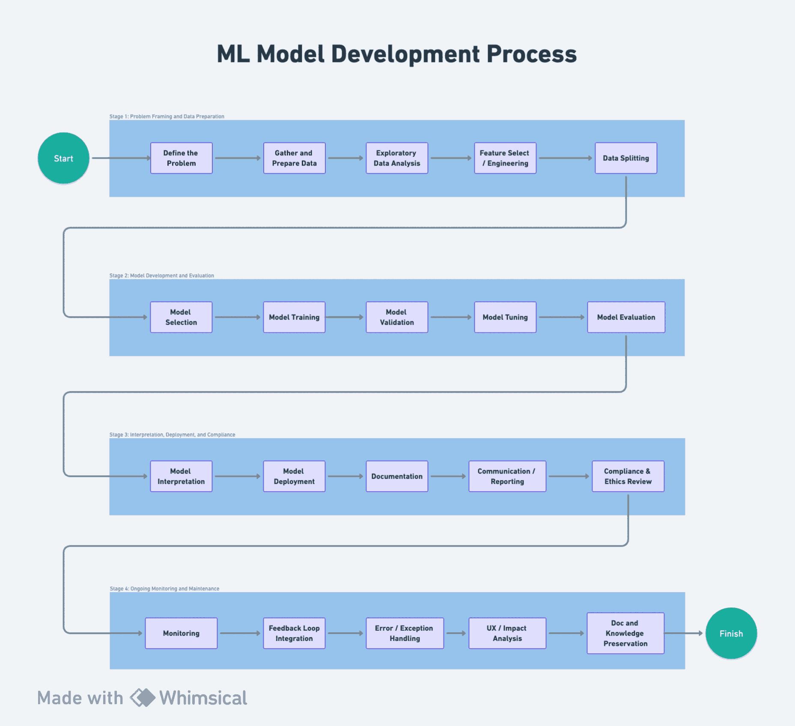

# Overview of Stages and Activities

Developing Machine Learning models for real-world use cases requires many activities to go from inception to production. We can group those activities into three high-level stages.

**Stage 1: Problem Framing and Data Preparation**
- Define the Problem
- Understand the Business or Scientific Objectives
- Gather and Prepare Data
- Exploratory Data Analysis (EDA)
- Feature Selection/Engineering
- Data Splitting

**Stage 2: Model Development and Evaluation**
- Model Selection
- Model Training
- Model Validation and Tuning
- Model Evaluation

**Stage 3: Interpretation, Deployment, and Compliance**
- Model Interpretation
- Model Deployment
- Documentation
- Communication and Reporting
- Compliance and Ethics Review

**Stage 4: Ongoing Monitoring and Maintenance**
- Performance Monitoring
- Data Monitoring
- Model Retraining and Updating
- Feedback Loop Integration
- Health Monitoring
- Error and Exception Handling
- Security and Compliance Monitoring
- User Experience and Impact Analysis
- Documentation and Knowledge Preservation

# Stage 1: Problem Framing and Data Preparation
The first stage is akin to laying the groundwork for a building. It requires precise understanding, planning, and preparation.

## Define the Problem
Defining the problem is the cornerstone of the project. It requires a clear understanding of what needs to be solved and why. It's not just about identifying the issue but framing it in a way that guides the rest of the project. Stakeholders' input, constraints, opportunities, and the ultimate goal of solving the problem must all be considered at this stage.

## Understand the Business or Scientific Objectives
This step aligns the problem with the broader objectives of the business or research. Understanding how the model will be used, who will use it, and what success looks like, ensures that the solution is relevant and valuable. It connects the technical aspects of the project with real-world goals and needs.

## Gather and Prepare Data
Data is the fuel for machine learning. Gathering and preparing it involves understanding where to find the right data, how to combine data from different sources, and how to clean and preprocess it. It requires dealing with missing values, handling outliers, and ensuring that the data is in a suitable format for modeling.

## Exploratory Data Analysis (EDA)
EDA is an open-ended process where the data is visualized and analyzed to understand its main characteristics and underlying patterns. It helps in identifying potential issues and opportunities in the data, providing critical insights that guide feature engineering and modeling.

## Feature Selection/Engineering
Selecting and engineering features is an art and science. It involves deciding which variables are most relevant for predicting the target and how they should be transformed or combined to capture the underlying phenomena. This step often requires domain knowledge and creativity, balancing complexity with interpretability.

## Data Splitting
Dividing the data into training, validation, and test sets is critical to assess the model's ability to generalize to new, unseen data. This step safeguards against overfitting, where a model performs well on the data it was trained on but poorly on new data.

# Stage 2: Model Development and Evaluation
This stage is where the mathematical magic happens. It's about choosing the right algorithm and training it to learn from the data.

## Model Selection
Choosing the right model involves understanding the problem type (e.g., classification, regression), the data characteristics, and the constraints of the project. It often requires experimentation with different algorithms to find the one that best captures the underlying patterns in the data.

## Model Training
Training the model is where the algorithm learns from the data. It's a process of adjusting the model's internal parameters so that it can accurately predict the target variable. This process can be complex and computationally intensive, requiring careful tuning and validation.

## Model Validation and Tuning
Validation is about assessing how well the model performs on data it hasn't seen during training. It involves tuning hyperparameters and selecting the model that performs best on a separate validation set. This iterative process helps in finding the right balance between fitting the data well without overfitting.

## Model Evaluation
Evaluating the model requires selecting appropriate metrics that reflect the goals of the project. Whether it's accuracy for a classification problem or mean squared error for regression, the chosen metrics provide a quantifiable measure of how well the model is performing.

# Stage 3: Interpretation, Deployment, and Compliance
The final stage is about turning the model into a working solution, interpreting its decisions, and ensuring that it's used responsibly.

## Model Interpretation
Interpreting the model is essential for trust and usability. It involves understanding how the model makes decisions, which features are important, and how individual predictions are made. It's not only about explaining the model to technical experts but also making it understandable for non-experts.

## Model Deployment
Deploying the model is about integrating it into a production environment where it can make real-time or batch predictions. It requires careful planning, collaboration with other teams, and understanding how the model will be used, monitored, and maintained.

## Monitoring and Maintenance
Once deployed, the model needs ongoing monitoring to ensure that it continues to perform as expected. This involves tracking performance metrics, identifying any drift in the data, and making necessary updates or retraining the model as needed.

## Documentation
Thorough documentation throughout the project is essential for collaboration, compliance, and future iterations. It covers everything from the initial problem definition to the final model, including all decisions, methodologies, and code.

## Communication and Reporting
Clear and ongoing communication with stakeholders and team members is key to the project's success. Regular updates, insights, and reports on the model's status and results ensure alignment and buy-in at all levels.

## Compliance and Ethics Review
Ethical considerations and legal compliance are paramount, especially in sensitive areas like healthcare or finance. It's about ensuring that the model is fair, transparent, and respects privacy and other legal requirements. This step often requires collaboration with legal and ethical experts to navigate complex regulations.

# Stage 4: Ongoing Monitoring and Maintenance

## Performance Monitoring
Performance Monitoring is crucial for tracking the model's predictive performance over time. This involves comparing real-world outcomes with predictions and monitoring for any signs of model drift, ensuring that the model continues to meet its objectives.

## Data Monitoring
Data Monitoring ensures the continued quality and relevance of the data feeding into the model. This includes detecting and handling anomalies, biases, or shifts in the data that might otherwise compromise model performance.

## Model Retraining and Updating
Regularly retraining the model with new data is essential for maintaining its accuracy and relevance. Implementing updates or setting up automatic retraining based on certain triggers ensures that the model evolves with the underlying data and context.

## Feedback Loop Integration
Feedback Loop Integration involves collecting feedback from end-users or real-world results and utilizing it for continuous improvement. This creates a virtuous cycle where the model improves and adapts based on real-world feedback.

## Health Monitoring
Health Monitoring focuses on the overall system's health, including aspects like latency and uptime. Ensuring that the model's infrastructure remains robust and responsive is key to providing consistent, reliable predictions.

## Error and Exception Handling
Robust error and exception handling are essential for dealing with unexpected issues that may arise in a production environment. Implementing clear paths for handling or reporting these issues minimizes disruptions and enhances reliability.

## Security and Compliance Monitoring
Ongoing checks to ensure legal and ethical compliance, along with monitoring for potential security vulnerabilities, are essential for maintaining trust and safety in the model's applications.

## User Experience and Impact Analysis
User Experience and Impact Analysis involves monitoring how the model is being used and assessing its broader impact. Analyzing the implications of the model on users and other stakeholders helps in refining and aligning the model with organizational goals.

## Documentation and Knowledge Preservation
Keeping documentation up-to-date with any changes and preserving knowledge and insights from the ongoing lifecycle ensures that the wisdom gained from the model's operation is retained for future use and improvement.
